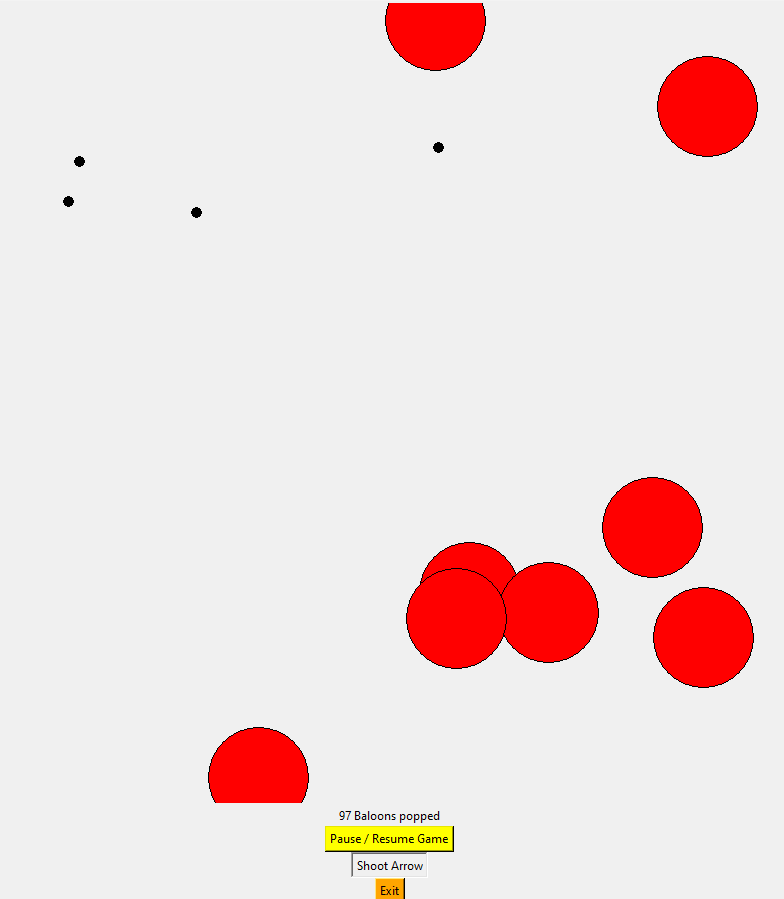

# python-baloon-game

This repository contains a simple physics project that allows you to play a balloon shooting game. The game starts by placing a starting point for a rock or object, and random balloons appear on the screen. Your objective is to shoot the balloons by clicking a button. If you hit a balloon, it will disappear.

Screenshots:



Feel free to explore the code and have fun playing the game!
To run the game, simply execute the `world.py` file using the following command:

```bash
python world.py
```

Make sure you have Python installed on your system before running the game. Enjoy playing!
